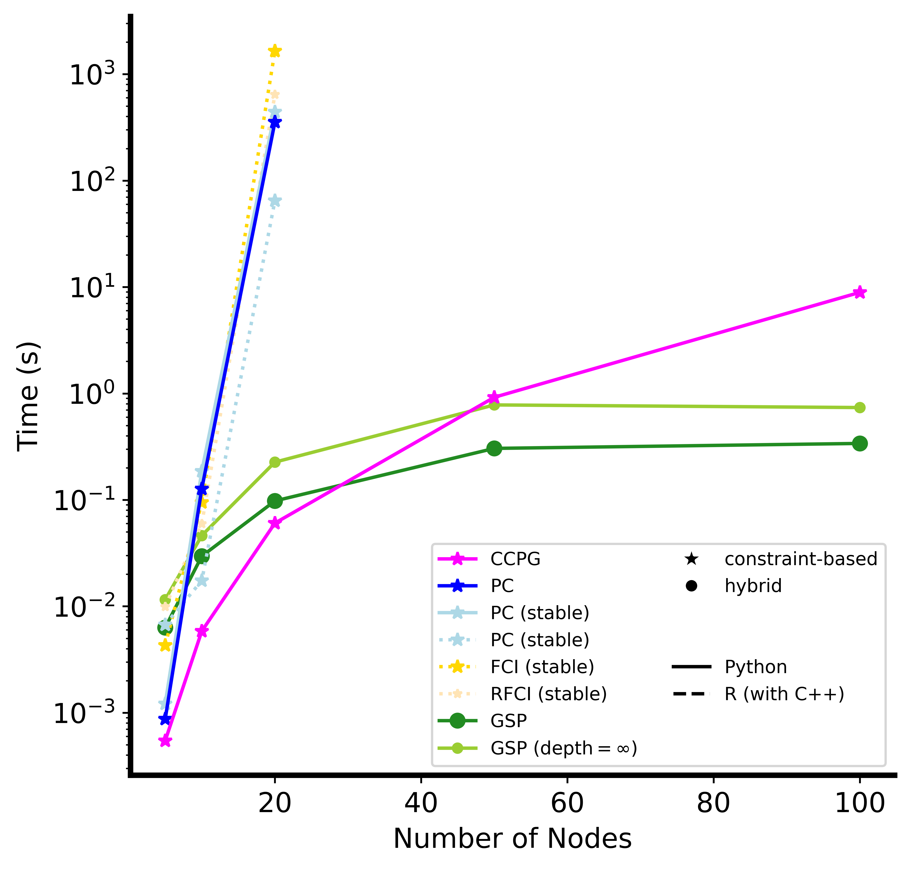
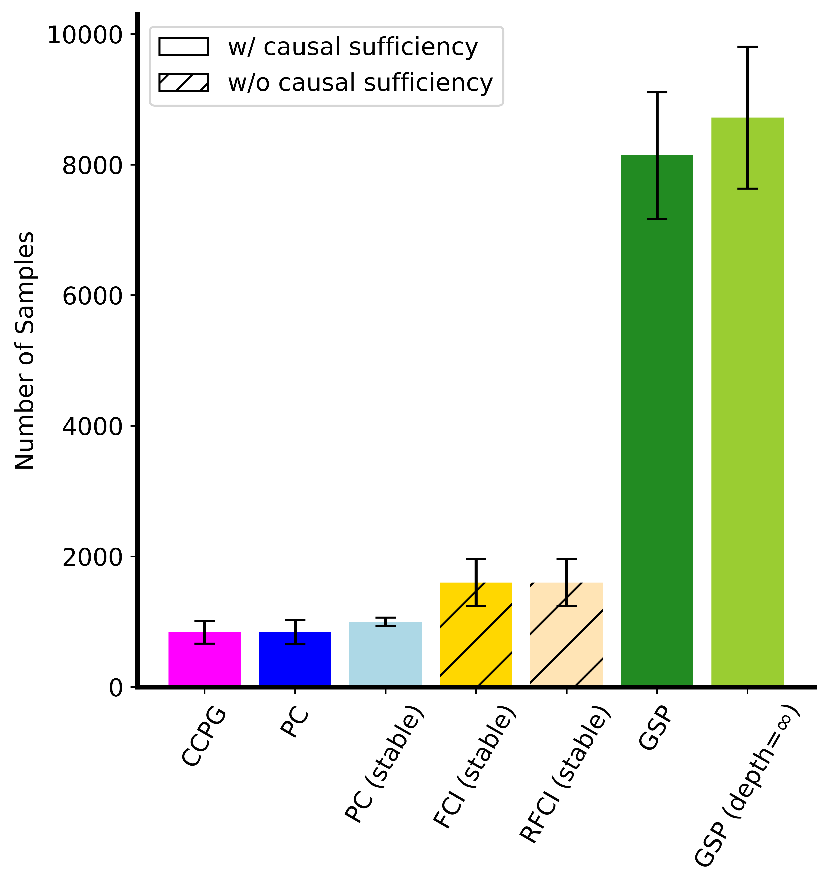
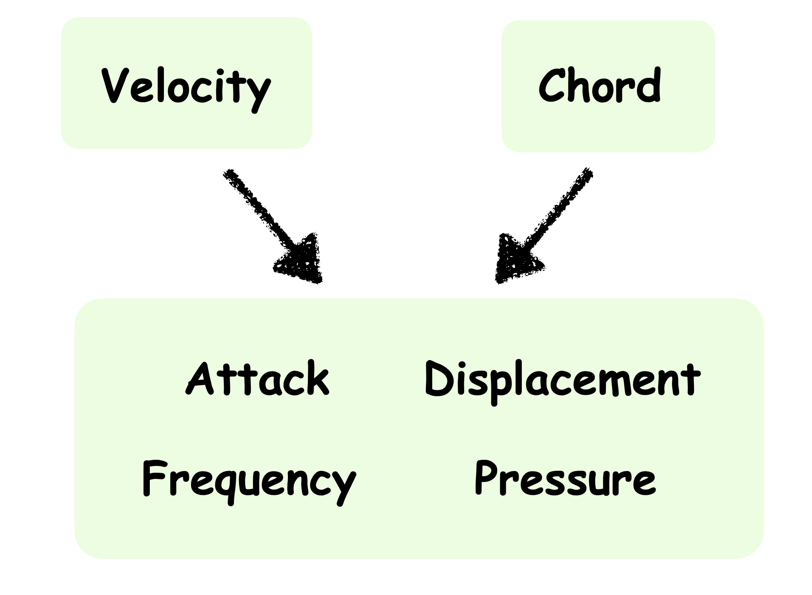
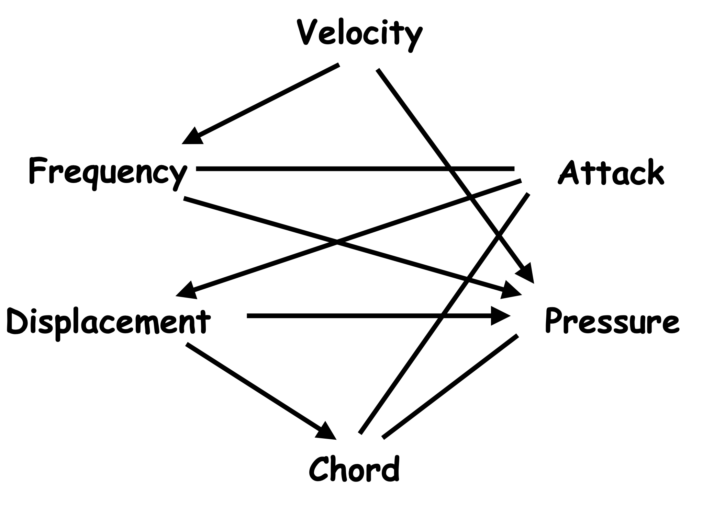

# Learning Causal Consistent Partition Graph (CCPG)
**Code for paper: Causal Discovery with Fewer Conditional Independence Tests (https://arxiv.org/abs/2406.01823) at ICML 2024.**

Source code and results comparing CCPG versus other constraint-based and hybrid causal discovery methods that rely on conditional independence tests. 
- The constraint-based methods we included are: PC [1], FCI [2], and RFCI [3] (we use their order independent variants from [4], a.k.a., "stable" versions).
- The hybrid methods we included are: GSP with depth=4 and depth= $\infty$ [5].

## Simulations
In these experiments, we generated samples from linear additive gaussian SCMs governed by identifiable causal graphs. 

**Summary of Results.** CCPG enjoys both the best sample efficiency of constraint-based methods (thus should be more accurate with limited samples) and runtime efficiency of hybrid methods (which allows scaling to larger graphs).

**Runtime Analysis**. We generated 100k samples across graphs of different sizes and reported the runtime averaged across five runs. The figure below show that CCPG is as fast as hybrid methods (GSP) and extremely more efficient than constraint-based methods (PC, FCI, and RFCI), who can only scale to 20 nodes with reasonable runtime.

<ins>_Implementation Detail._</ins> For FCI and RFCI, we used pcalg [9]'s implementations, which are written in R with C++ accelerations. For PC and GSP, we used causaldag [10]'s implementations, which are written in python. Our method, CCPG, is written in python. The acceleration of R (with C++) can be viewed by comparing two implementations of PC (stable) below. 

  

**Sample Complexity Analysis**. On a 10-node graph, for each method, we increased the number of samples until it finds the ground-truth DAG (we repeated this procedure for five runs). The figure below show that CCPG requires the least number of samples to recover the true graph. 

Constraint-based methods like PC, FCI and RFCI are more sample efficient than hybrid methods, while being much more runtime inefficient. In comparison, CCPG, with its polynomial-number of CI test guarantees, enjoys low sample complexity and low runtime complexity.

<ins>_Remark on causal sufficiency._</ins> Among the constraint-based methods, we marked the ones that do not assume causal sufficiency. These methods require more samples compared to e.g., PC, as the underlying system we test on satisfies causal sufficiency.

## Real-world Validation
To evaluate the relevance of CCPG for real-world settings, we included a simple 6-variable Airfoil example [6,7]. The dataset is downloaded from [8]. See [7] for a detailed description of the 6 variables. Although there is no known ground-truth DAG in this example, a few causal relations are known:
- velocity, chord, and attack should be source nodes.
- pressure is downstream of all other nodes.

The coarse representation learned by CCPG is give in the figure below.

Compared to PC, who finds the following CPDAG, CCPG seems to be more consistent with the known causal relations while it contains less information since the representation is coarser.

#### References
[1] Spirtes, P., Glymour, C. N., Scheines, R., and Heckerman, D. Causation, Prediction, and Search.\
[2] Spirtes, P. L., Meek, C., and Richardson, T. S. Causal inference in the presence of latent variables and selection bias.\
[3] Colombo, D., Maathuis, M. H., Kalisch, M., and Richardson, T. S. Learning high-dimensional directed acyclic graphs with latent and selection variables.\
[4] Colombo, D., and Maathuis, M. H. Order-independent constraint-based causal structure learning.\
[5] Solus, L., Wang, Y., and Uhler, C.. Consistency guarantees for greedy permutation-based causal inference algorithms.\
[6] Asuncion, A., and Newman, D. UCI machine learning repository. \
[7] Lam, W. Y., Andrews, B., and Ramsey, J. Greedy relaxations of the sparsest permutation algorithm. \
[8] https://github.com/cmu-phil/example-causal-datasets \
[9] https://cran.r-project.org/web/packages/pcalg/index.html \
[10] https://github.com/uhlerlab/causaldag/tree/master
